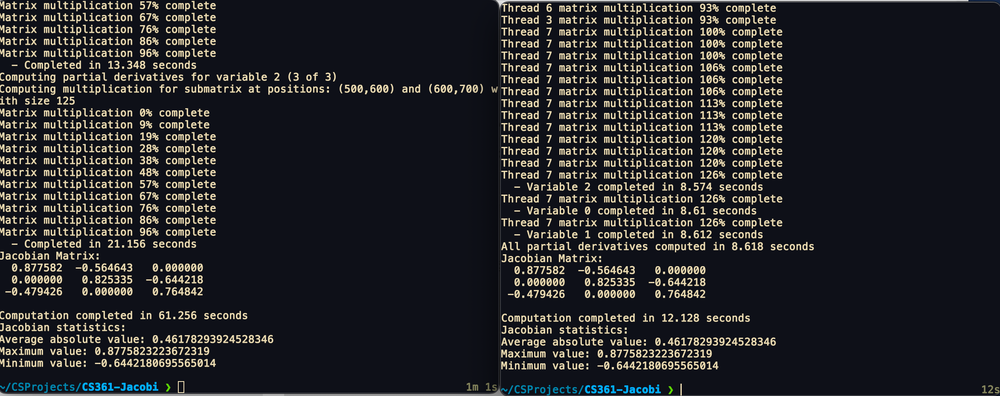

# JavaAdvancedConcurrency
See the computational power of parallelism by testing Jacobian matrix multiplication

This is a simple Project to test a sequential Jacobian matrix multiplication versus a parallel one. There isn't any serious computational power that is needed, but it might take a while depending on your hardware. 

Ran on: Mac M1 Air 16GB Ram

Left console: Sequential                            
Right console: Parallel

This uses the available threads on your machine. Just make sure you OpenJDK installed
